```{r setup, include=FALSE}
options(htmltools.dir.version = FALSE)

library(rjags)
library(R2jags)
library(R2WinBUGS)
library(coda)
library(lattice)

assets <- read.csv("F:/LEIDY/bluepill5/xaringan_dml/__code__/JAGS/data/dataQuery_ago-27-2013-23_17.csv")
time <- as.Date(assets$X)

```

class: center, middle

# ¿Modelos Dinámicos Lineales? 

---

class: center, middle

# ¿Modelos de Espacio de Estados? 


---

class: center, middle

# ... mmmmmm ...

<p align="center">

</p>


---

class: inverse, center, middle

# Notación

---

class: left, middle

# Proceso estocástico:

Un **proceso estocástico** es una familia de variables aleatorias asociadas a un conjunto índice de números reales, tal que a cada elemento del conjunto índice le corresponda una y sólo una variable, es decir, $\{ Y_t; t \in T\}$, donde $T$ es el conjunto índice y $Y_t$ es la variable aleatoria correspondiente al elemento $t$ de $T$. 


---

class: left, middle

# Serie de tiempo

Una **serie de tiempo** es un conjunto de observaciones $(y_1,\ldots,y_t)$, generadas por un proceso estocástico, cuyo conjunto índice se toma con relación al tiempo. 

*Suponemos series de tiempo donde el conjunto índice $T$ es un conjunto finito o infinito numerable, también conocidas como series de tiempo discretas, además de considerar que las observaciones se realizan a intervalos de tiempo iguales.*

---

class: center, middle

# **PROCESO**
# $\{Y_t\}_{t\geq 1}$


# **DISTRIBUCIÓN CONJUNTA**
# $(Y_1,\ldots,Y_t)$

---


class: center, middle

<p align="center">
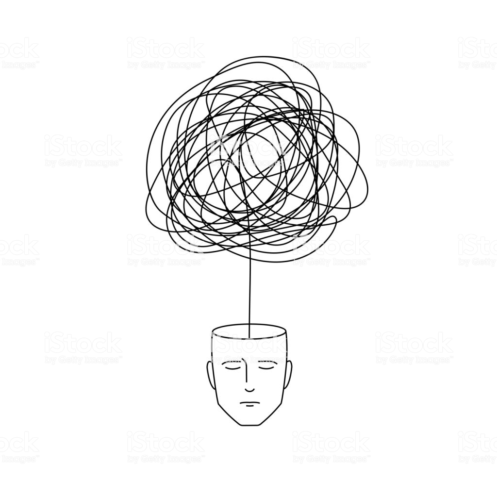
</p>


---

class: center, middle

# **Independencia o Intercambiabilidad**


---

class: center, middle

# **¿Y el tiempo?**

---

class: center, middle

# Keep it simple

<p align="center">
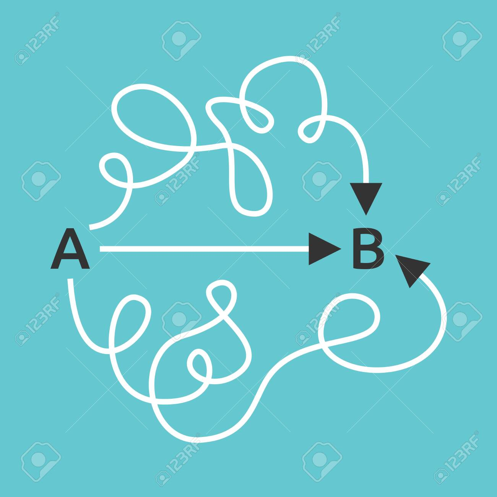
</p>

---

class: center, middle

# **Propiedad de Markov**

---

# Propiedad de Markov:

Se dice que una sucesión de variables aleatorias $\{Y_t\}_{t\geq 1}$ es una *Cadena de Markov* si $\forall  t>1$ :

$$
\begin{aligned}
\pi (y_t\mid y_{1:t}) =  \pi (y_t\mid y_{t-1})
\end{aligned}
$$

Donde $\pi(y)$, es la distribución marginal de Y. 

--

Bajo esta definición se puede escribir la distribución conjunta de la variables $(Y_1,\ldots,Y_t)$ como sigue:

$$
\begin{aligned}
\pi (y_{1:t}) = \pi (y_1) \prod\limits_{j=2}^t \pi (y_j\mid y_{j-1})
\end{aligned}
$$
--

## ¿Tiene sentido?

--

$$
\begin{aligned}
\{\theta_t : t=0,1, \ldots \}
\end{aligned}
$$
---

class: center, middle

<p align="center">
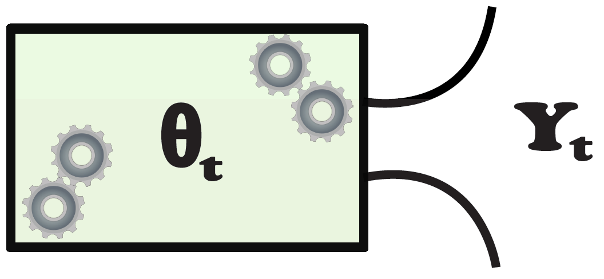
</p>

---

# Modelos de espacio de Estados:

Un *modelo de espacio de estados* consiste de los procesos real valuados, $\{\theta_t : t=0,1, \ldots \} \in {R}^p$  y $\{y_t : t=0,1, \ldots \} \in {R}^m$  que satisfacen:

--

- **(A.1)** $\{\theta_t\}$ es una cadena de Markov.

--

- **(A.2)** Condicionando sobre $\theta_t$ las $Y_t^\prime s$ son independientes, $Y_t$ depende de $\theta_t$ solamente.

--

De lo anterior se puede observar que el modelo queda completamente especificado por la distribución inicial o distribución a priori, $\pi(\theta_0)$, y las densidades condicionales $\pi (\theta_t\mid \theta_{t-1})$ y $\pi (y_t\mid \theta_t)$, esto es $\forall t>0:$

--

$$
\begin{aligned}
\pi (\theta_{0:t}, y_{1:t}) = \pi (\theta_0) \prod\limits_{j=1}^t \pi (\theta_j\mid \theta_{j-1})\pi (y_j\mid \theta_j)
\end{aligned}
$$

--

Con lo que observamos que se pueden, ya sea condicionando o calculando las marginales, obtener las distribuciones que sean de interés.

---

class: center, middle

# Gráfica Acíclica Dirigida (DAG)

<p align="center">
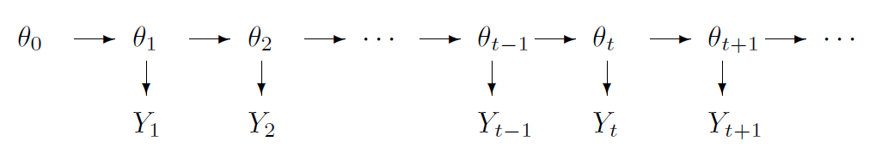
</p>


Estructura de dependencia de un modelo de espacio de estados.

---

# Gráfica Acíclica Dirigida (DAG)

Podemos demostrar que $Y_t$ y $(\theta_{0:t-1},Y_{1:t-1})$ son condicionalmete independientes dado $\theta_t$, por lo antes mencionado. 

La demostración consistiría en mostrar que cualquier trayectoria que une a $Y_t$ con algún elemento de $(\theta_{0:t-1},Y_{1:t-1})$, tiene que pasar a través de $\theta_t$, por lo que se tendría que:

--

$$
\begin{aligned}
\pi(y_t\mid\theta_{0:t-1},Y_{1:t-1})=\pi(y_t\mid\theta_t)
\end{aligned}
$$
--
De igual manera, podemos demostrar que $\theta_t$ y $(\theta_{0:t-2},Y_{1:t-1})$ son condicionalmete independientes dado $\theta_{t-1}$, es decir:

--

$$
\begin{aligned}
\pi(\theta_t\mid\theta_{0:t-2},Y_{1:t-1})=\pi(\theta_t\mid\theta_{t-1})
\end{aligned}
$$
---

background-image: url(./__imgs__/DAG5.jpg)

background-position: 50% 50%
class: center, bottom

---

class: center, middle

# ¿Entonces?

<p align="center">

</p>


---

class: center, middle

# Keep it **MORE** simple

<p align="center">

</p>

---

# Modelos Dinámicos Lineales:

Uno de los casos particulares y más importantes de los Modelos de espacio de estados son los **Modelos de Espacio de Estados Gaussianos Lineales**, también conocidos como **Modelos Dinámicos Lineales**.

--

Un Modelo Dinámico Lineal, queda especificado por una distribución a priori Normal $p$-dimensional, para  el estado del vector al tiempo $t=0$, es decir:

--

$$
\begin{aligned}
\theta_0 \sim\mathcal{N}_p(m_0,C_0)
\end{aligned}
$$
--

junto con el par de ecuaciones para cada tiempo $t\geq1$,

--

- **Ecuación de las observaciones:**
$$
\begin{aligned}
Y_t=F_t\theta_t+v_t,\hspace{12mm} v_t \sim\mathcal{N}_m(0,V_t)
\end{aligned}
$$
--

- **Ecuación de los estados:**

$$
\begin{aligned}
\theta_t=G_t\theta_{t-1}+w_t,\hspace{12mm} w_t \sim\mathcal{N}_P(0,W_t)
\end{aligned}
$$
---

# Modelos Dinámicos Lineales:

Donde $Y_t$ es un vector de orden $m$, $\theta_t$ es un vector de orden $p$, $G_t$ y $F_t$ son matrices conocidas de orden  *p x p* y *m x p*, respectivamente, y $\{v_t\}_{t\geq1}$ y $\{w_t\}_{t\geq1}$ son dos sucesiones de variables aleatorias independientes con distribución *Normal*, con media cero y varianzas $\{V_t\}_{t\geq1}$ y $\{W_t\}_{t\geq1}$, respectivamente. 

*Se supone además, que $\theta_0$ es independiente de $\{v_t\}$ y $\{w_t\}$.*

--

Se puede mostrar qué los DLM son un caso particular de los Modelos de Espacios de Estados, esto es debido a que en los Modelos de Espacio de Estados, se puede especificar cualquier otra distribución a priori distinta a la Normal, junto con las ecuaciones:

--

$$
\begin{aligned}
Y_t = h_t(\theta_t, v_t),
\end{aligned}
$$

$$
\begin{aligned}
\theta_t = g_t(\theta_{t-1},w_t),
\end{aligned}
$$

para cualquier función $g_t$ y $h_t$.

---

# Estimación:

Supongamos que disponemos de información hasta el tiempo t (i.e. $y_{1:t}$), y estamos interesados en hacer inferencias del vector de estados, entonces deseamos obtener la densidad condicional $\pi(\theta_s\mid y_{1:t})$, para ello tendríamos que distinguir tres diferentes casos en los que podríamos estar interesados:

--

- **Filtración**; cuando $s=t$, 

--

- **Pronóstico**; cuando $s>t$. 

--

- **Suavizamiento** o **análisis retrospectivo**; cuando $s<t$

---

# Filtración (Filtro de Kalman):

## IDEA:

- **(i)** Se obtiene la distribución predictiva del estado $\theta_t$, dadas las observaciones $y_{1:t-1}$, (i.e. $\pi(\theta_t\mid y_{1:t-1})$), usando la densidad *"filtrada"* $\pi(\theta_{t-1}\mid y_{1:t-1})$ y la distribución condicional $\pi(\theta_t\mid \theta_{t-1})$;

--

- **(ii)** Se obtiene la distribución predictiva de la siguiente observación $y_t$ dadas las observaciones anteriores $y_{1:t-1}$, (i.e. $\pi(y_t\mid y_{1:t-1})$);

--

- **(iii)** Se obtiene la distribución filtrada $\pi(\theta_t\mid y_{1:t})$ usando la regla de Bayes con  $\pi(\theta_t\mid y_{1:t-1})$ como la distribución a priori y $\pi(y_t \mid \theta_t)$ como la de verosimilitud.

---

class: center, middle

# Filtro de Kalman:

<p align="center">
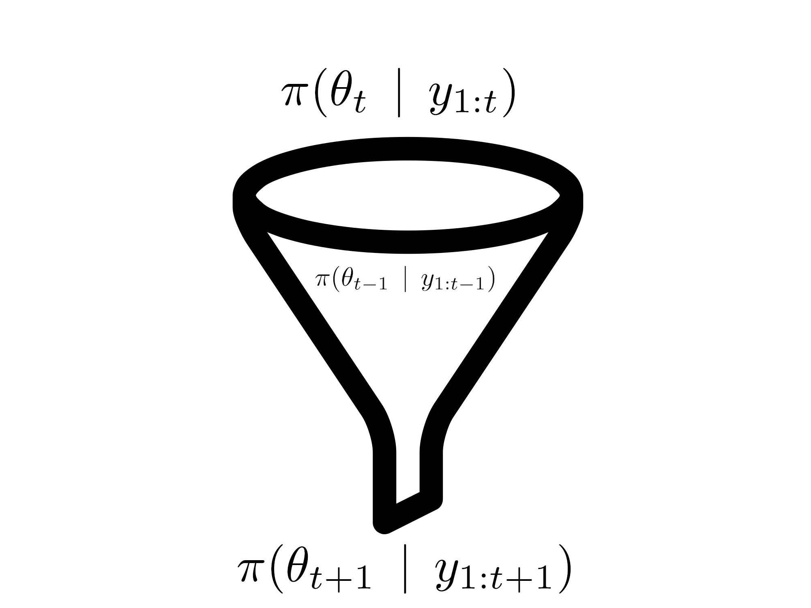
</p>


---

# Filtro de Kalman para los DLM:

Consideremos un DLM, y supongamos:
$$
\begin{aligned}
\theta_{t-1}\mid y_{1:t-1} \sim\mathcal{N}(m_{t-1},C_{t-1})
\end{aligned}
$$

Entonces los siguientes enunciados se cumplen:

--

- **(i)** La distribución predictiva (del primer paso) de $\theta_t$ dado $y_{1:t-1}$ es Gaussiana con parámetros:

$$
\begin{aligned}
a_t=E(\theta_t\mid y_{1:t-1})=G_tm_{t-1}, \\
R_t=Var(\theta_t\mid y_{1:t-1})=G_tC_{t-1}G'_t+W_t.
\end{aligned}
$$
--

- **(ii)** La distribución predictiva (del primer paso) de $Y_t$ dado $y_{1:t-1}$ es Gaussiana con parámetros:

$$
\begin{aligned}
f_t=E(Y_t\mid y_{1:t-1})=F_ta_t,\\
Q_t=Var(Y_t\mid y_{1:t-1})=F_tR_tF'_t+V_t.
\end{aligned}
$$
---

# Filtro de Kalman para los DLM:

 - **(iii)** La distribución filtrada de $\theta_t$ dado $y_{1:t}$ es Gaussiana con parámetros:
 
$$
\begin{aligned}
m_t=E(\theta_t\mid y_{1:t})=a_t+R_tF'_tQ^{-1}_te_t,\\
C_t=Var(\theta_t\mid y_{1:t})=R_t-R_tF'_tQ^{-1}_tF_tR_t,
\end{aligned}
$$
--

donde $e_t=Y_t-f_t$, es el error de predicción.


---
background-image: url(./__imgs__/recursion_2.jpg)
background-size: cover
background-position: 50% 50%
class: center, bottom, inverse


---

# Suavizamiento:

## **Kalman smoother**

Consideremos un DLM, si:
$$
\begin{aligned}
\theta_{t+1}\mid y_{1:T} \sim\mathcal{N}(s_{t+1},S_{t+1})
\end{aligned}
$$

entonces:

--

$$
\begin{aligned}
\theta_{t}\mid y_{1:T} \sim\mathcal{N}(s_{t},S_{t}),
\end{aligned}
$$

donde:

--

$$
\begin{aligned}
s_t&=m_t+C_tG_{t+1}'R_{t+1}^{-1}(s_{t+1}-a_{t+1})\\
S_t&=C_t-C_tG_{t+1}'R_{t+1}^{-1}(R_{t+1}-S_{t+1})R_{t+1}^{-1}G_{t+1}C_t
\end{aligned}
$$

---

# Pronóstico:

Considera el DLM especificado, y supongamos que:

$$
\begin{align}
a_t(0)=m_t y R_t(0)=C_t
\end{align}
$$

Entonces los siguientes enunciados se cumplen:

--

 - **(i)** La distribución predictiva de $\theta_{t+k}$ dado $y_{1:t-1}$ es Gaussiana con parámetros:

$$
\begin{align}
a_t(k)&=G_{t+k}a_{t}(k-1), \\
R_t(k)&=G_{t+k}R_{t}(k-1)G'_{t+k}+W_{t+k}.
\end{align}
$$
--

- **(ii)** La distribución predictiva de $Y_{t+k}$ dado $y_{1:t}$ es Gaussiana con parámetros:

$$
\begin{align}
f_t(k)&=F_{t+k}a_t(k), \\
Q_t(k)&=F_{t+k}R_t(k)F'_{t+k}+V_{t+k}.
\end{align}
$$


---

# Modelo de Regresión:

Un modelo de regresión lineal simple, tiene la siguiente forma:

$$
\begin{align*}
Y_{t}= \beta_1 + \beta_2 x_t + \epsilon_t,\hspace{12mm} \epsilon_t\stackrel{iid}{\sim}\mathcal{N}(0,\sigma_t^2)
\end{align*}
$$

--

Debido a que estamos interesados en su aplicación a series de tiempo, el suponer que los errores $\{\epsilon_t\}$ son $i.i.d.$, no es algo razonable. Una solución es considerar la evolución en el tiempo de la relación entre $x$ y $y$. A estos modelos se les conoce como, *modelos de regresión dinámicos*, y tienen la, forma:

--

$$
\begin{align*}
Y_{t}= \beta_{1,t} + \beta_{2,t} x_t + \epsilon_t,\hspace{12mm} \epsilon_t\stackrel{iid}{\sim}\mathcal{N}(0,\sigma_t^2),
\end{align*}
$$
---

# Modelo de Regresión:

Lo que nos define a un DLM, con $F_t = [1  \hspace{2mm} x_t]$, $\theta_t = [\beta_{1, t} \beta_{2, t}]'$, $V = \sigma^2$, y una ecuación de estado para $\theta_t$, es decir:

--

$$
\begin{align*}
Y_{t} &= x'_t\theta_t + v_t, \hspace{12mm} v_t \sim \mathcal{N}(0,\sigma_t^2)\\
\theta_t &= G_t\theta_{t-1} + w_t, \hspace{12mm} w_t \sim \mathcal{N}(0,W_t^2)
\end{align*}
$$

--

donde $x'_t = [x_{1, t}, \ldots, x_{p, t}]$ son los valores de la $p$-ésima variable explicativa al tiempo $t$. Una elección común es considerar a $G_t$ como la matriz identidad y a $W$ como una matriz diagonal, en otras palabras, modelar los coeficientes de regresión como una caminata aleatoria. 


---

class: inverse, center, middle

# Implementación

<p align="center">

</p>

---

# DLM en la modelación de rendimientos:

Como ejemplo consideremos los precios de las acciones en el mercado, los cuales cambia a través del tiempo; surgen nuevas acciones, las existentes pueden desaparecer o combinarse con otras, una gran cantidad de situaciones pueden suceder.

--

Por ello, como implementación de los DLM, se uso el modelo conocido como CAPM (por sus siglas en inglés, Capital Asset Pricing Model), el cual  intenta estimar el rendimiento de una  acción o portafolio, en su sentido más general.

--

El CAPM, tiene un rol importante en la selección de portafolios conforme a las preferencias media/varianza, es decir, se busca tener grandes rendimientos con el mínimo riesgos.

--

Los datos utilizados abarcan el peridodo de: Enero del 2012 a Diciembre del 2012, y son los siguientes:

- Precios de la acción: Apple.
- Precios del portafolio de mercado: $SP\&500$.
- Rendimientos de la acción libre de riesgo: Bonos del gobierno (T-Bill).

---

class: center, middle

# Precios Normalizados

<p align="center">
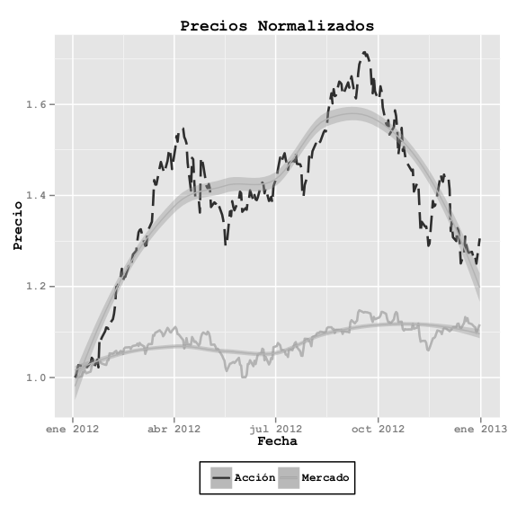
</p>

---

# Regresión Lineal Simple:

```{r eval=FALSE}
summary(outLM)
##
## Call:
## lm(formula = equity.exc.retornos.diarios ~ market.exc.retornos.diarios)
##
## Residuals:
## Min 1Q Median 3Q Max
## -0.06719 -0.00976 -0.00099 0.00866 0.07232
##
## Coefficients:
## Estimate Std. Error t value Pr(>|t|)
## (Intercept) 0.00393 0.00232 1.69 0.092 .
## market.exc.retornos.diarios 1.18709 0.12121 9.79 <2e-16 ***
## ---
## Signif. codes: 0 '***' 0.001 '**' 0.01 '*' 0.05 '.' 0.1 ' '  1
##
## Residual standard error: 0.0157 on 248 degrees of freedom
## (60 observations deleted due to missingness)
## Multiple R-squared: 0.279,Adjusted R-squared: 0.276
## F-statistic: 95.9 on 1 and 248 DF, p-value: <2e-16
```

---

## Usando JAGS (o dlm?):

```{r eval=FALSE}
r_P <- assets$equity.retornos.diarios
r_M <- assets$market.retornos.diarios

RegDLM = "
model{
#### Data Model
for(i in 1:n){
r_P[i] ~ dnorm(alpha[i] + beta[i] * r_M[i], 1/v)
}
#### Process Model
for(i in 2:n){
    alpha[i] ~ dnorm(alpha[i-1], 1/w_1)
    beta[i] ~ dnorm(beta[i-1], 1/w_2)
}
#### Priors
alpha[1] ~ dnorm(m_alpha, v_alpha)
beta[1] ~ dnorm(m_beta, v_beta)
v ~ dgamma(a_v, r_v)
w_1 ~ dgamma(a_w1, r_w1)
w_2 ~ dgamma(a_w2, r_w2)
}
"

```

---

## Usando JAGS:

```{r cache=TRUE, eval=FALSE}
data <- list(r_P = r_P,
             r_M = r_M,
             n = length(r_P),
             m_alpha = 0.001,
             v_alpha = 0.01,
             m_beta = 1,
             v_beta = 0.05,
             a_v = 1,
             r_v = 1,
             a_w1 = 1,
             r_w1 = 1,
             a_w2 = 1,
             r_w2 = 1)

nchain = 4
init <- list()
for(i in 1:nchain){
    e <- runif(1, 0.00001, 0.00005)
    init[[i]] <- list(v = 0.00393,
                      w_1 = 0.00001,
                      w_2 = 0.005)
}


```

---

## Usando JAGS:

```{r cache=TRUE, eval=FALSE}
fit <- jags(data = data, inits = init, 
            parameters.to.save = c("v","w_1", "w_2"), 
            n.chains = 4, n.iter = 10000, n.burnin = 1000, 
            model.file = textConnection(RegDLM))

# Diagnostico
# Convirtiendo el modelo en un objeto MCMC
fit.mcmc <- as.mcmc(fit)
summary(fit.mcmc)
# Utilizando los comandos de coda
xyplot(fit.mcmc)
xyplot(fit.mcmc,layout = c(2,6), aspect = "fill")
# Graficas de  las Densidades
densityplot(fit.mcmc)
densityplot(fit.mcmc, layout = c(2,6), aspect = "fill")

```

---

# Traza

<p align="center">

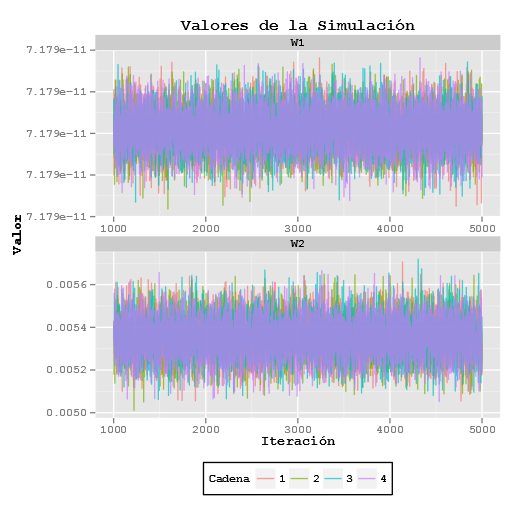
</p>

---

# Densidades

<p align="center">
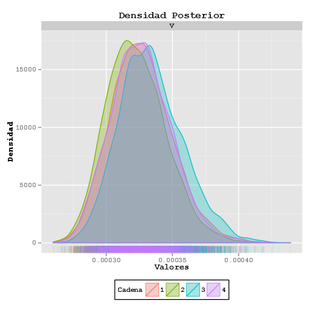
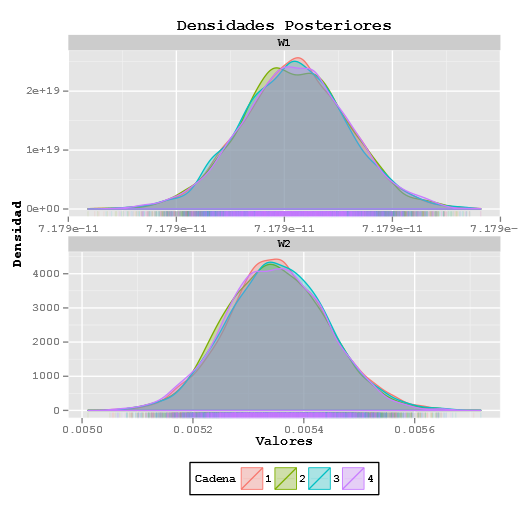
</p>

---

# Medias Móviles

<p align="center">
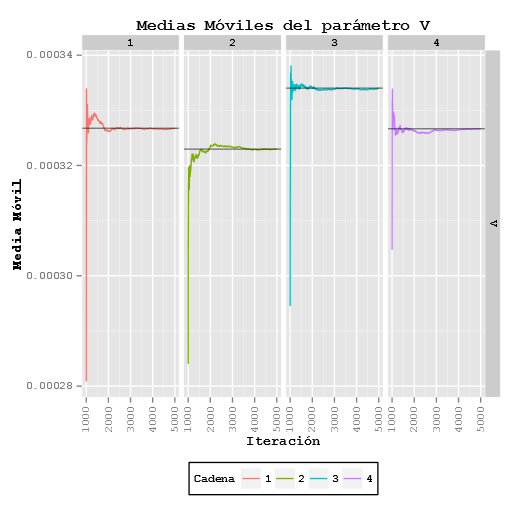
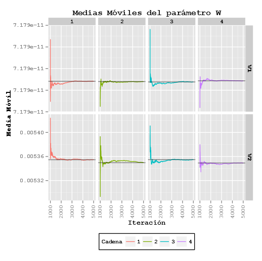
</p>

---

# Autocorrelaciones

<p align="center">
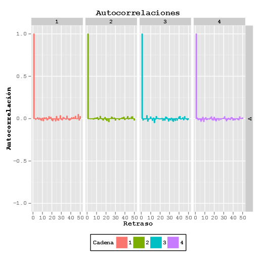
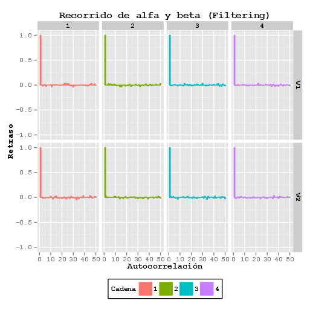
</p>

---

# Distribuciones Aposteriori

<p align="center">
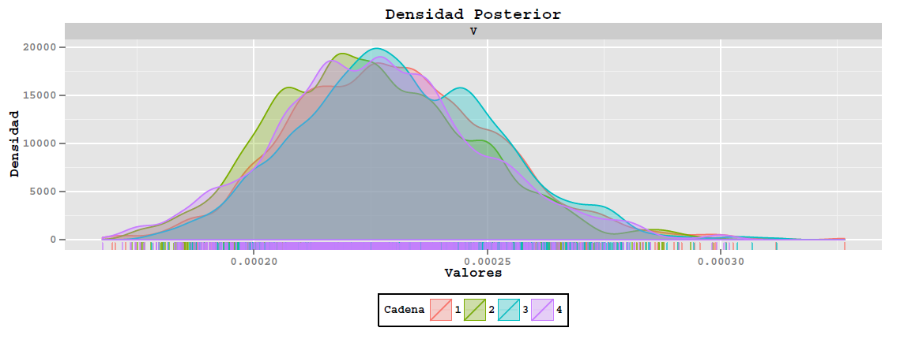
</p>

<p align="center">
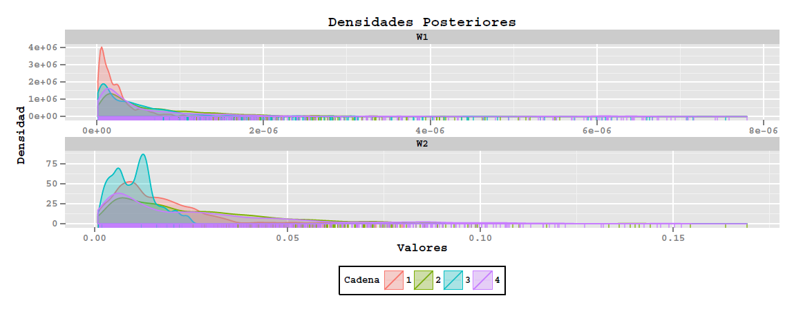
</p>

---

# Recorrido Alfa y Beta Filtering

<p align="center">

</p>

---

# Recorrido Alfa y Beta Smoothing

<p align="center">
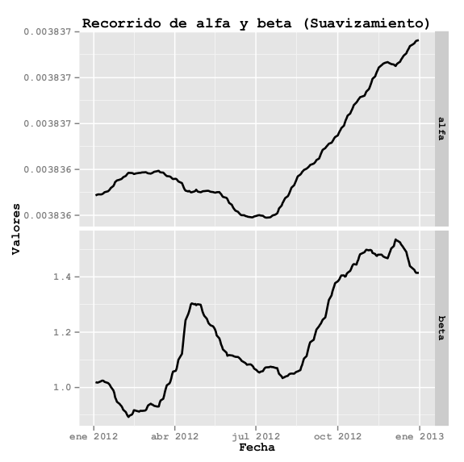
</p>


---

# Alfa

<p align="center">

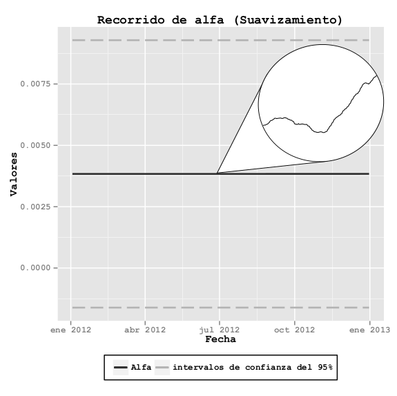
</p>


---

# Beta

<p align="center">
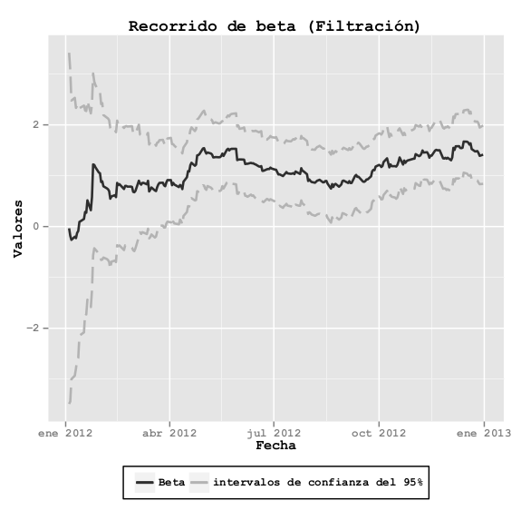
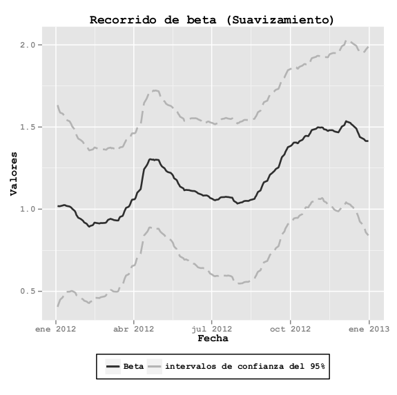
</p>


---

# Predicción

<p align="center">
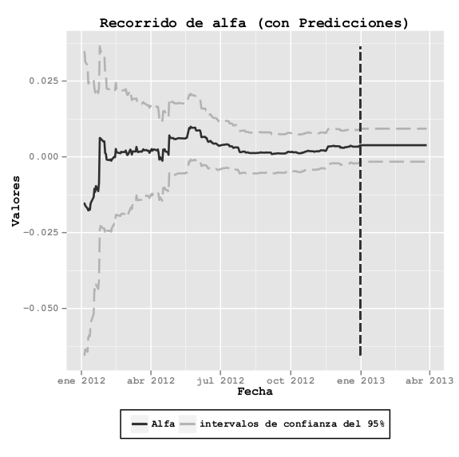
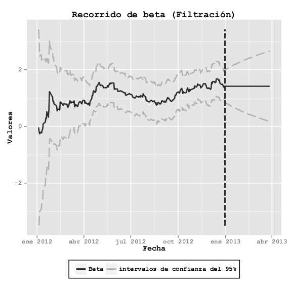
</p>


---

# Evaluación

<p align="center">
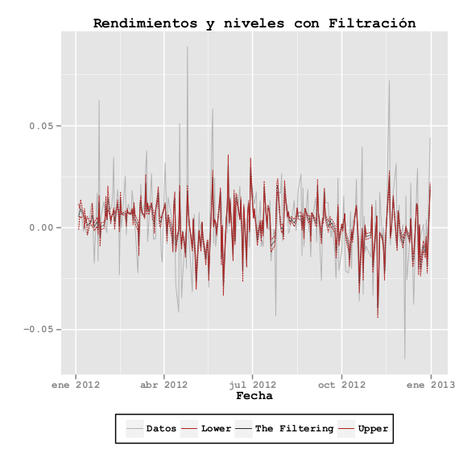
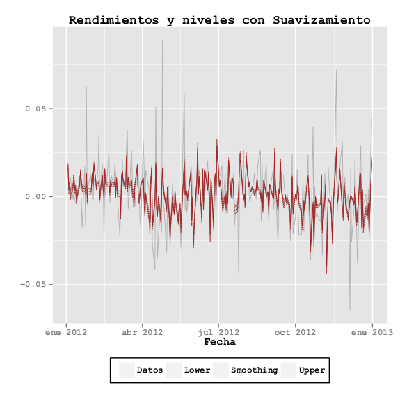
</p>

---

class: inverse, center, middle

# ¿Mejoras?

<p align="center">

</p>

---

class: center, middle

<p align="center">
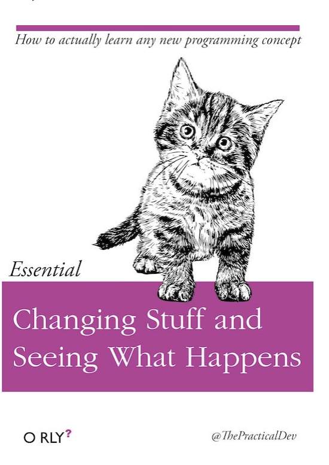
</p>


---

# DAG -> DBN

<p align="center">
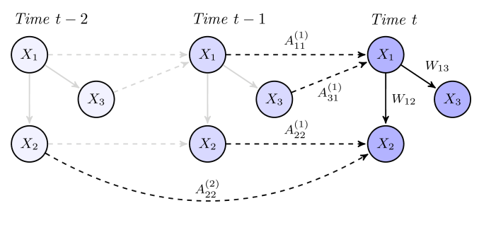
</p>


---

# Aplicación en series multivariadas:

- **SUTSE (Seemingly unrelated time series equations)**

Consideremos la serie de tiempo, $Y_t = (Y_{1, t}, \ldots, Y_{m, t})'$,  es decir, contamos con $m$ series de tiempo.

La idea es *agrupar* las series en un único sistema, por ejemplo en nuestro caso, $\theta_t = (\alpha_{1, t}^{P}, \ldots, \alpha_{m, t}^{P}, \beta_{1, t}^{P}, \ldots, \beta_{m, t}^{P})'$, a esta forma de modelar las series, o mejor dicho, a esta clase de modelos se les conoce como **SUTSE (Seemingly unrelated time series equations)**, los cuales se pueden plantear más específicamente de la siguiente forma:

$$
\begin{align}
Y_{it} &= (F\otimes I_m)\theta_t+ v_{t}, \hspace{12mm} v_{t} \sim \mathcal{N}(0,V)\\
\theta_t &= (G\otimes I_m)\theta_{t-1} + w_{t}, \hspace{10mm} w_{t} \sim \mathcal{N}(0,W)
\end{align}
$$
--

A los modelos que surgen de aplicar este modelo a uno
de regresión lineal dinámico, se les conoce como **SUR (Seemingly unrelated regression)**.

---

# Aplicación en series multivariadas:

<p align="center">
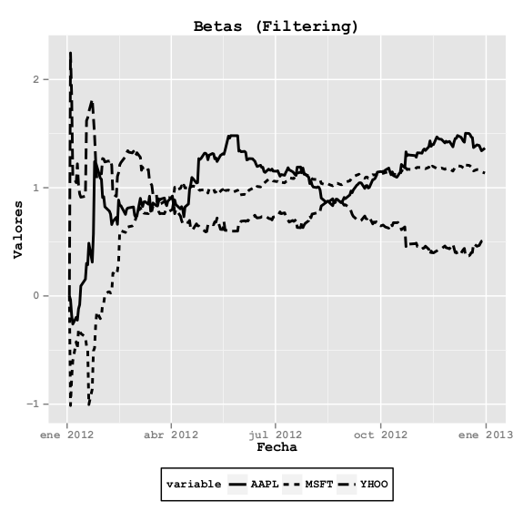
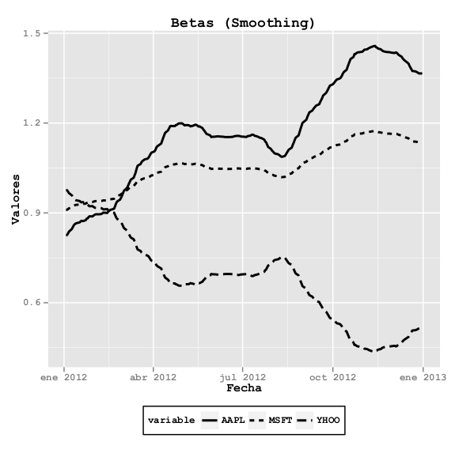
</p>

---

# Actualización de los datos:

- **Sequential monte carlo methods** o **Particle filters**

<p align="center">
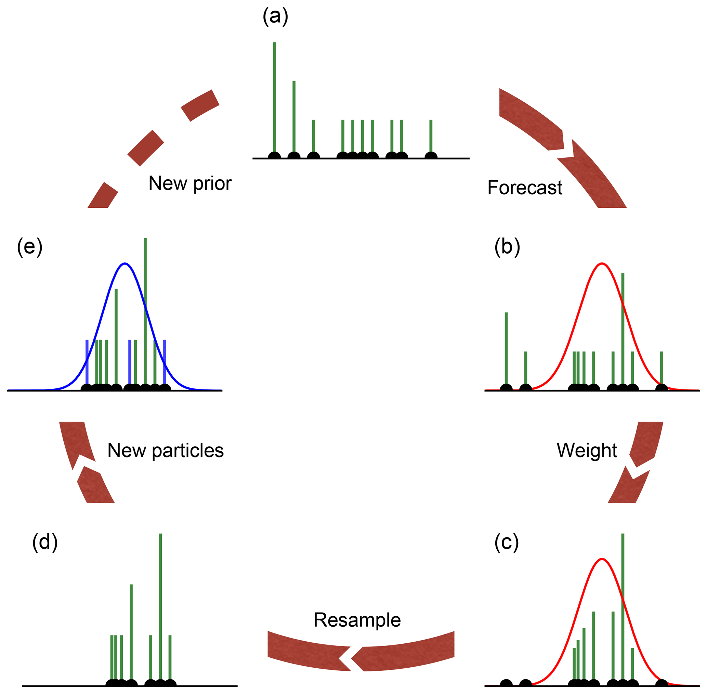
</p>


---

# Conmetarios Finales:

<p align="center">

</p>

---

class: center, middle

# ¡Gracias!

<p align="center">

</p>

